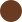

# Brazebattery

قالب HTML فروشگاه بِریز باتری. بوت‌استرپ RTL برای چیدمان است تا CSS اضافه کم بماند. آیکون‌ها از [Bootstrap Icons](https://icons.getbootstrap.com) هستند. جاوااسکریپت خام است و جی‌کوئری ندارد.

نسخه فعلی فقط دسکتاپ است تا قبل از ریسپانسیو تأیید مشتری گرفته شود.

## الهام بخش‌ها

- [parsget.com](https://parsget.com)
  - جمع‌وجور شدن هدر بعد از اسکرول: نوار باریک‌تر می‌شود و ارتفاع لوگو کمتر می‌شود.
  - دکمه «لیست محصولات»: همان حلقه نورانی چرخان دور دکمه «شروع رایگان»، با گرادیانت نارنجی `--primary` و `--secondary` به‌جای آبی. فلش هنگام هاور کمی جلو می‌رود.
  - دکمه «تماس بگیرید»: همان ساختار دکمه «مشاهده تعرفه‌ها» با چیپ گرد آیکون. رنگ آیکون همان `--primary` پارس‌گت (`#03172c`) است، نه نارنجی قالب.
  - هاور لینک زیرمنو: پس‌زمینه خاکستری همان زیرمنوی «مستندات»، ذخیره‌شده در `--gray1` (`#dde6ee`).

- [g1verify.ir](https://g1verify.ir)
  - پس‌زمینه شیشه‌ای هدر فیکس: `backdrop-filter: blur(18px)` و گوشه ۲۰ پیکسل. چون صفحه جی‌وان تیره است و این قالب روشن، شدت سفیدی شیشه برای زمینه روشن تنظیم شده تا همان حس مات دیده شود.
  - سه باکس کم‌رنگ سمت چپ: جستجو، سبد خرید، ورود. اندازه ۴۴ در ۴۴ و گوشه ۱۲ پیکسل، مثل دکمه‌های همان سایت. با هاور فقط کمی تیره‌تر می‌شوند و نارنجی نمی‌شوند. کلیکشان فعلاً کاری نمی‌کند.
  - هاور لینک منوی بالا فقط یک پس‌زمینه خیلی کم‌رنگ دور لینک می‌آورد و رنگ متن عوض نمی‌شود. آیتم فعال هم همان پس‌زمینه را دارد.
  - ارتفاع نوار فیکس ۷۶ پیکسل است و لوگو و ابزارها از وسط عمودی چیده شده‌اند.

- [پیش‌نمایش Touex](https://preview.envytheme.ir/touex/index.html)
  - باز شدن زیرمنو با `perspective` و `rotateX`؛ منو از بالا باز می‌شود و سر جایش می‌نشیند.
  - فلش کنار آیتم‌های دارای زیرمنو با هاور ۱۸۰ درجه می‌چرخد.

- [ishop.ivahid.com](https://ishop.ivahid.com)
  - اسلایدر هیرو: گوشه ۲۰ پیکسل و فلش‌های کناری با همان فرم منحنی سفید، چسبیده به لبه کادر. با هاور، زبانه سفید تیره‌تر می‌شود.

- [ExArt](https://template.dsngrid.com/exart/index.html)
  - جابه‌جایی عکس پس‌زمینه اسلایدر با اعوجاج WebGL افقی، همان خانواده افکت displacement اسلایدر فول‌پیج اگزآرت. عنوان و دکمه‌ها ثابت می‌مانند.

- [سپید دیجیتال](https://bamina.ir/sepid/digital2/)
  - ردیف معرفی: یک ستون `col-lg-6` و دو ستون `col-lg-3`.

- [مهرنوش](https://mehrnooshtheme.ir/mehrnoosh-1/)
  - سربرگ «جدیدترین محصولات» و کارت «بیشتر بدانید».
  - کاروسل دیدگاه خریدارها، بدون عکس و ستاره.

- [کوزیون](https://html.nextwpcook.com/cosion/index-two.html)
  - حلقه ضربان دور دکمه پخش.

- [تابلو نامور](https://tablonamvar.com/)
  - شمارنده سابقه، پروژه، محصول و مشتری با پر شدن عدد هنگام اسکرول. کادر به‌جای زرد، `--primary` است.
  - نوار «مشاوره و استعلام قیمت».

- [سرخط خبرهای دانشگاه](https://thc.tums.ac.ir/Image)
  - محو شدن سفید دو لبه نوار لوگو، مثل `::before` و `::after` کلاس `bn-news`.

گوشه کادرهای قالب یکسان و برابر `--radius2` (۲۰ پیکسل) است. ورود عنوان محصولات شبیه `fade-right` و دکمه کاتالوگ شبیه `fade-left` در AOS است، با `IntersectionObserver` و بدون خود کتابخانه.

## رنگ‌ها

| نام | کد | نمونه |
| --- | --- | --- |
| primary | `#ff6600` |  |
| secondary | `#d64300` |  |
| third | `#970000` |  |
| fourth | `#5f8e09` |  |
| fifth | `#125b37` |  |
| brown1 | `#8b573e` |  |
| brown2 | `#6a3b22` |  |
| yellow1 | `#ffce72` |  |
| gray1 | `#dde6ee` |  |
| gray2 | `#d2d2d2` |  |
| green1 | `#25d366` |  |
| green2 | `#1a952e` |  |

`--secondary` یک‌بار در متغیرها تعریف شده. گرادیان دکمه اسلایدر و پس‌زمینه دکمه افزودن به سبد از همین متغیر می‌آیند.

## فایل‌ها

- `css/bootstrap.rtl.min.css` فایل بوت‌استرپ است و دست نمی‌خورد.
- `css/style.css` استایل خود قالب است. CSS کتابخانه AOS از اینجا حذف شده.
- `css/swiper-bundle.min.css` و `js/swiper-bundle.min.js` برای اسلایدر و کاروسل‌های بعدی.
- `js/bootstrap.bundle.min.js` باندل بوت‌استرپ ۵.۰.۲، هم‌نسخه با CSS موجود. به جی‌کوئری وابسته نیست. نسخه minify حدود ۷۸ کیلوبایت است و gzip شده نزدیک ۲۴ کیلوبایت. منوی هاور دسکتاپ با CSS کار می‌کند؛ این فایل برای قطعات بعدی مثل مودال و منوی موبایل مانده.
- `js/scripts.js` هدر فیکس، اعوجاج پس‌زمینه اسلایدر، کاروسل دیدگاه‌ها، شمارنده و ورود هنگام اسکرول.
- `img/logo.png` لوگوی اصلی. اگر لود نشود، `img/logo.svg` جایگزین می‌شود.
- `img/slide-1.jpg` و `img/slide-2.jpg` عکس‌های پس‌زمینه اسلایدر.
- `img/promo-care.jpg` بنر موقت دو ستون کناری معرفی.
- `img/products/` عکس موقت کارت محصول.
- `img/clients/` لوگوی موقت نوار مشتریان تا رسیدن فایل اصلی.
- `img/swatches/` نمونه رنگ‌های جدول بالا.
